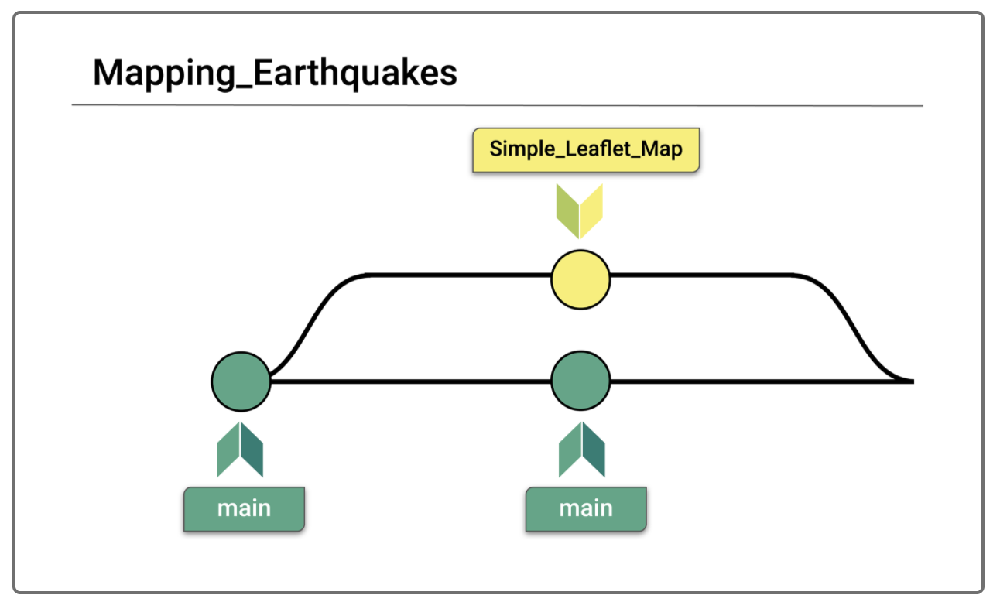
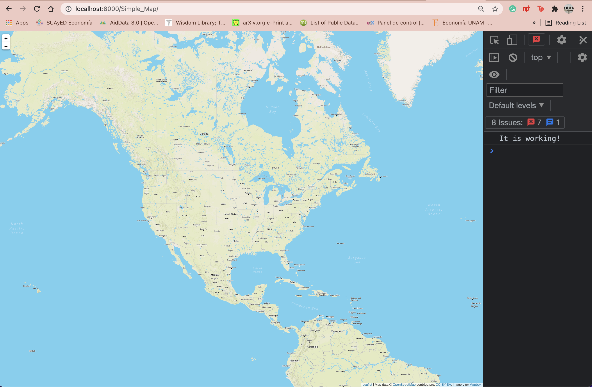
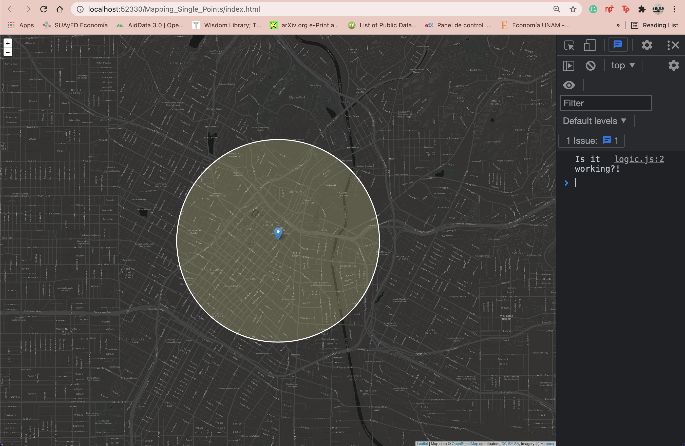
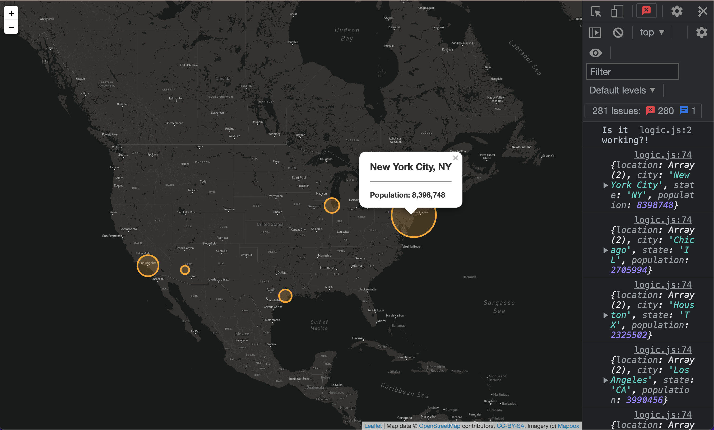
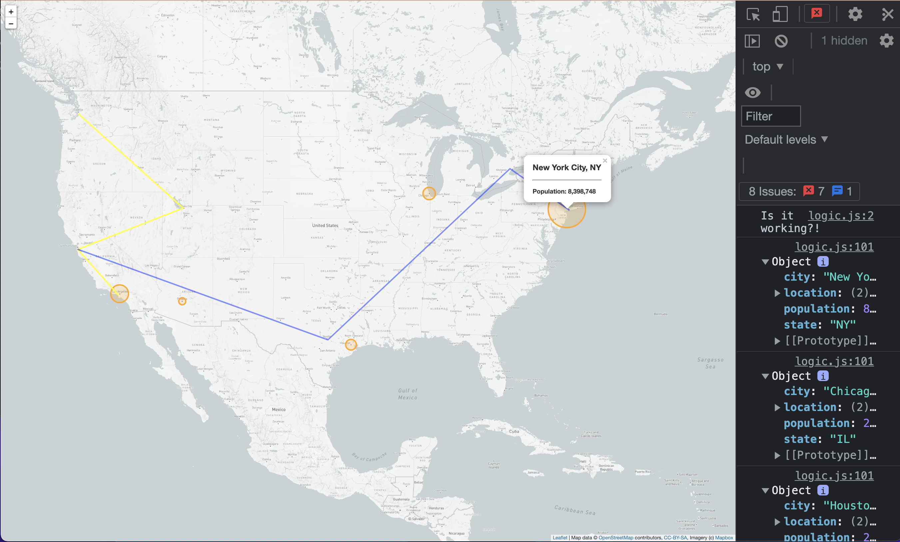
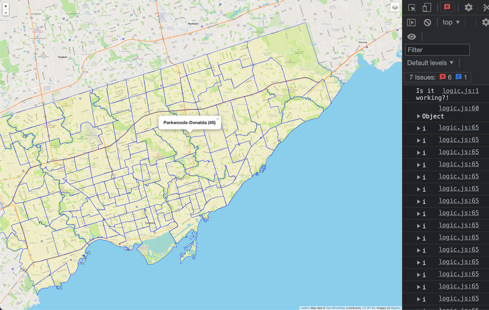
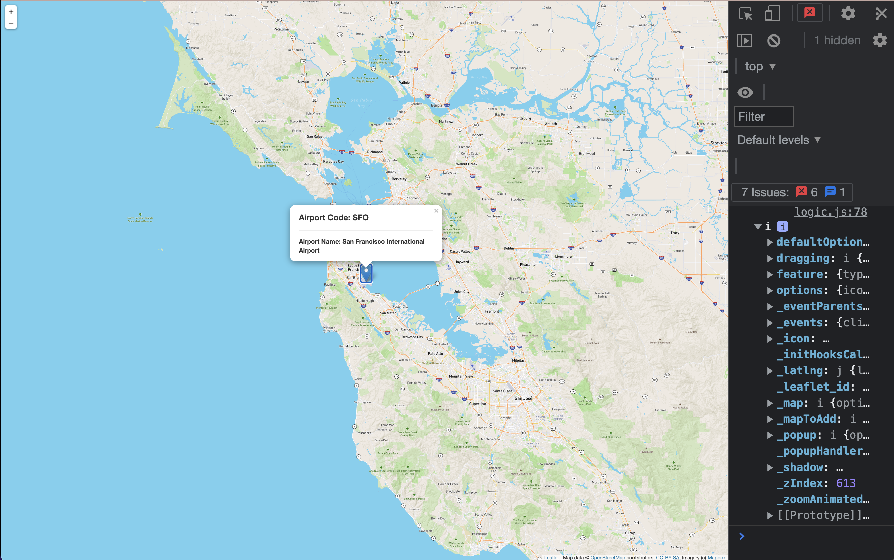
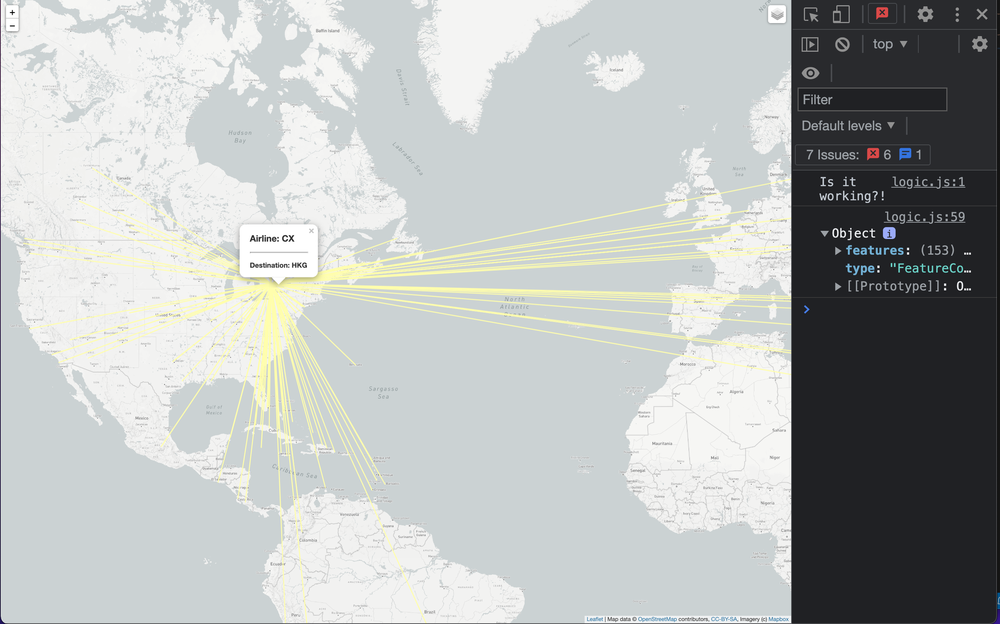

# **Mapping-Earthquakes :smiley:

With an API is requested data to a server that hosts geographical maps. For instance, the project allows a few things:
1. Populate geographical maps with GeoJSON data using JavaScript and the Data-Driven Documents (D3) library.
2. Add multiple map layers to geographical maps using Leaflet control plugins to add user interface controls.
3. Use JavaScript ES6 functions to add GeoJSON data, features, and interactivity to maps.
4. Render maps on a local server. :exploding_head:

## ***Overview of Project

The purpose of this project is to visually show the differences between the magnitudes of earthquakes all over the world for the last seven days.
Through the `9 branches` the maps represent the isolated environments creating codes no matter the scope.
"Creating branches off the main branch is where Git shines. A branch allows you to make changes to the main code "off to the side," like a branch on a tree. Once the code on the branch has been reviewed and approved, only then can the branch be merged into the main branch. This ensures that the main branch always contains production-quality code."
> Washignton University of St. Louis :nerd_face:

Example of `Simple_Leaf_Map` branch in comparisson with the `main` branch.

## ***Results :compass:
The progression of the branches or environments where the data is called throught the API are shown below:
1. Simple visualization of map

2. Simple visualization of map with simple points

3. Simple visualization of map with multiple points

4. Simple visualization of map with lines

5. Geomaping with JSON visualizing polygons

6. Geomaping with JSON visualizing points

7. Geomaping with JSON visualizing linestrings

8. Visualization of earthquakes in the past 7 days (mode: streets and satelite)

9. Visualization of earthquakes, major earthquakes and tectonic plates (mode: streets and satelite)

## ***Summary :globe_with_meridians:
The challenge of the projects reflects layes of tectonic plates added to the map. Additionally, using knowledge of JavaScript, `Leaflet.js`, and geoJSON data. It adds major earthquake data to the map using `d3.json()`. 
It is added color and set the radius of the circle markers based on the magnitude of earthquake, and added a popup marker for each earthquake that displays the magnitude and location of the earthquake using the GeoJSON layer, `geoJSON()`.

